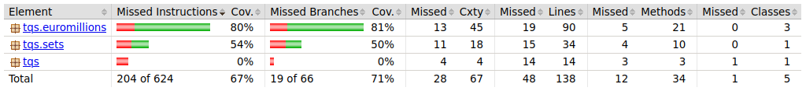

# TQS_113664

Diogo Lopes Oliveira
LEI
NMEC:113 664
Repositório TQS 2025

# 1.1 j) Considering the previous point, can you think of a scenario where the TqsStack will fail despite the 
#        high coverage level? To which extent can one rely on code coverage to assess quality of your code?

Tendo em conta o trabalho feito na alínea anterior, é possível que o TqsStack falhe em casos em que o utilizador tente, por exemplo, apagar um número de elementos
que seja igual ao número de elementos que o stack, isto pois não foi implementada nenhuma verificação para este caso, embora possamos partir do pressuposto
que nenhum problema ocorrerá, visto que o código foi testado para todos os outros casos possíveis.

# 1.2 c) Assess the coverage level in project “Euromillions-play” using Jacoco

🔹 Pacote tqs.euromillions tem a melhor cobertura → 80% de instruções cobertas e 81% dos ramos de decisão testados.
🔹 Pacote tqs.sets tem cobertura baixa → Apenas 54% de instruções e 50% de ramos cobertos.
🔹 Pacote tqs tem 0% de cobertura → Não há testes escritos para este pacote.

