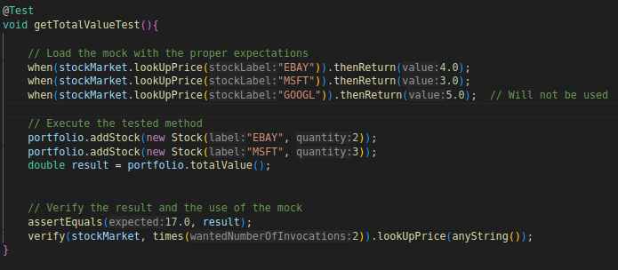
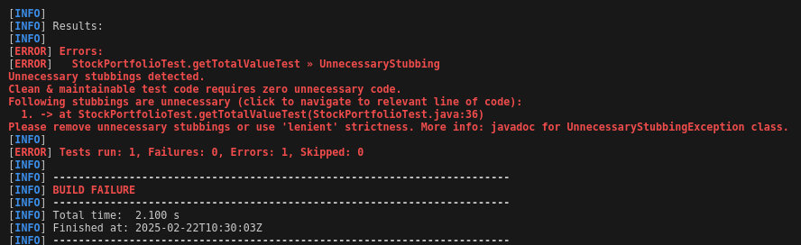

# TQS 113664 | Diogo Lopes Oliveira | LEI 
# LAB2

# 2.1 Stocks Portfolio

## 2.1 b) Create the test for the totalValue().

## 2.1 c) Add more expectations; in fact, add more “stocks” types in the expectations that those that will be used/needed in the test. 

        
        when(stockMarket.lookUpPrice("GOOGL")).thenReturn(5.0);  // Will not be used

## 2.1 d) Consider using the Hamcrest or AssertJ to create more human-readable assertions. Refactor your code.