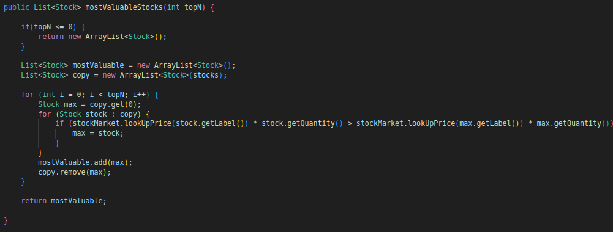
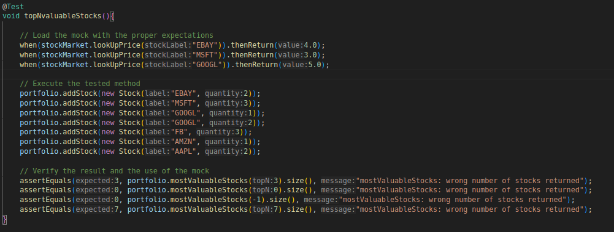

# TQS 113664 | Diogo Lopes Oliveira | LEI 
# LAB2

# 2.1 Stocks Portfolio

## 2.1 b) Create the test for the totalValue().

## 2.1 c) Add more expectations; in fact, add more “stocks” types in the expectations that those that will be used/needed in the test. 

        
        when(stockMarket.lookUpPrice("GOOGL")).thenReturn(5.0);  // Will not be used

## 2.1 e) Add a new method to StocksPortfolio to return the top n most valuable shares.

## 2.1 f) Write tests for the new code yourself.
