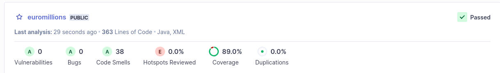
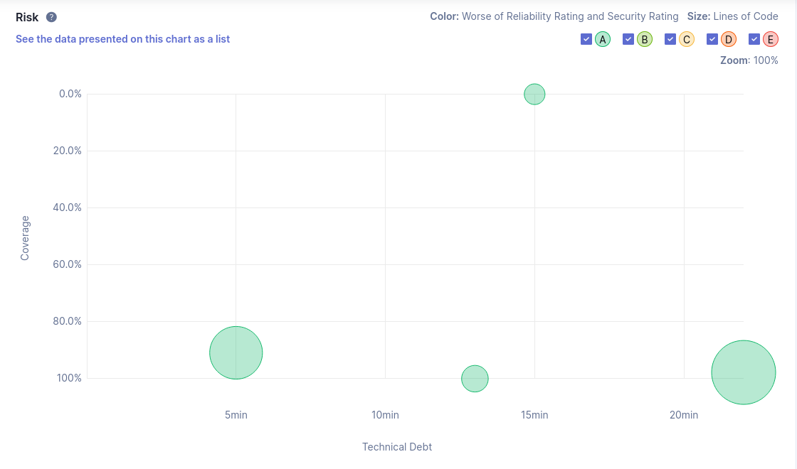
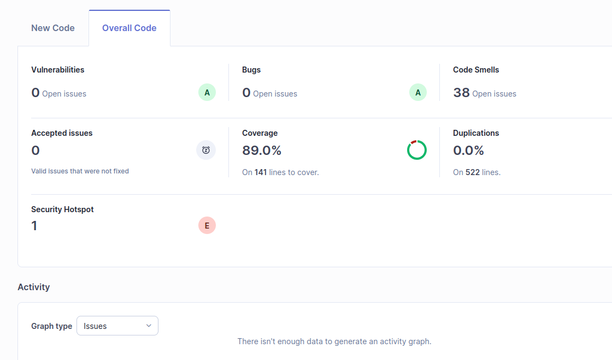

# 8.1

f)
## SonarQube Analysis ✅

A análise do projeto foi realizada com sucesso usando o SonarQube Community Edition.

🔗 Dashboard: [http://localhost:9000/dashboard?id=euromillions](http://localhost:9000/dashboard?id=euromillions)

### 🧪 Resultados principais:
- Quality Gate: **Passed**
- Cobertura de testes: **89%**
- Vulnerabilidades: **0**
- Bugs: **0**
- Code Smells: **38**
- Duplicação de código: **0%**
- Hotspots de segurança: **1**

Apesar de alguns code smells e um hotspot, o projeto cumpre os critérios de qualidade definidos.

> Screenshots do dashboard estão incluídas para referência.

g)

Issue------------| Description--------------------------------------------------------------------------------------| How to solve-------------------------------------------------
-----------------|--------------------------------------------------------------------------------------------------|--------------------------------------------------------------|
Security---------| O projeto contém 1 security hotspot que pode indicar um possível ponto de vulnerabilidade.       | Rever o código sinalizado e seguir as boas práticas de segurança (ex: validações, melhoria de inputs, etc.).   |                                                                                                  |
Reliability......| Nenhum bug detetado → o sistema é fiável neste momento.	                                        |  Continuar a escrever testes para cobrir cenários de falha e exceções.
Maintainability--| Existem 38 code smells, o que indica más práticas como código duplicado ou mal estruturado.	    |  Refazer os trechos indicados (nomes pouco claros, métodos longos, etc.).
Security hotspot-| 1 hotspot identificado, que pode representar risco de segurança em certos contextos.	            | Analisar manualmente o hotspot no SonarQube e aplicar medidas preventivas.

h) Checkstyle, PMD e SpotBugs são ferramentas externas de análise estática de código Java que detetam problemas de qualidade, como más práticas, erros comuns, e potenciais bugs.

Eles podem ser integrados com o SonarQube para fornecer relatórios detalhados diretamente na interface da análise.

## -----------------------------------------
# 8.2

## c)

## d)

Falta cobertura em aproximadamente 11% do código, o que equivale a cerca de ~16 linhas, podendo ser melhorado com mais testes unitários.